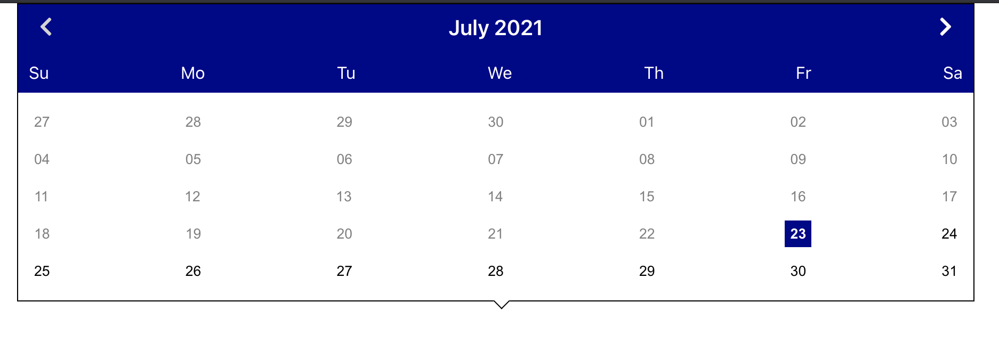

## Calendar

A re-usable calendar component for react.


### Installation

The package can be installed via [npm](https://github.com/npm/cli)

```
npm install --save react-accessible-calendar
```

 or via [yarn](https://github.com/yarnpkg/yarn)

```
yarn add react-accessible-calendar
```

React should be included separately since that dependency is not included in the package. Below is the sample of how to use the Calendar in React.

```js
import React, { useState } from 'react';
import { Calendar } from 'react-accessible-calendar';
import './App.css';

function App() {
  const [date, setDate] = useState(new Date()),
    min = '',
    max = '',
    blocked = [];
  return (
    <div className="App">
      <Calendar
        dates={{
          selectedDate: date,
          min: min,
          max: max,
          blocked: blocked
        }}
        themeColor=''
        onDateChange={setDate}
      ></Calendar>
    </div>
  );
}

export default App;
```

### Configuration

You can pass following props to personalize the Calendar

```
selectedDate: The user can pass the date, that needs to be highlighted.
```
```
min: The minimum date upto which the Calendar should be active. The dates are disabled beyond min date. 
By default, min date is present date. All the past dates are disabled.
```
```
max: The maximum date upto which the Calendar should be active. The dates are active only upto max date. 
The dates after max date are disabled.
```
```
The min and max date can be a string in '01/01/2020' format or can be in this new Date('01/01/2020') format.
```
```
blocked: This feature is currently not present in this release. It will be implemented in future release.
```
```
themeColor: The Calendar month-year header background color can be changed using themeColor.
```
```
onDateChange: The user can call a function whenever a date is selected from the calendar.
```

### date-fns

`date-fns` library has been used, which uses native Date objects.

### Browser Support

It is compatible with latest versions of Chrome, Safari and IE10+.

###Development

The master branch contains the latest code of react-accessible-calendar. You can clone the repo and run

```
npm install
```
```
npm start
```

to run the app.

### Accessibility

#### Keyboard support

1. Up arrow key: Moves to previous week.
2. Down arrow key: Moves to next week.
3. Left arrow key: Moves to previous day.
4. Right arrow key: Moves to next day.

Also, `aria-label`s have been added so that the screen readers can read the dates in month-day-year format.

### Demo

You can see the demo here,

[Calendar](https://accessible-calendar.netlify.app/).
